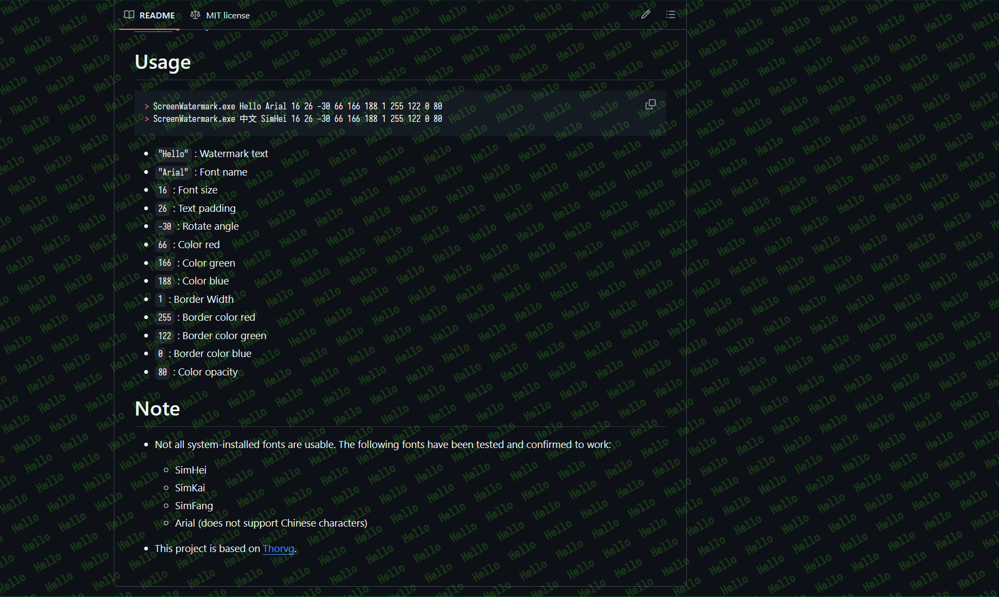

# ScreenWatermark
A tiny, low-resource screen watermarking tool.

# Features

- Extremely lightweight, `1.12MB`.
- Very low memory footprint, `4.5MB`.
- No CPU usage, `0%`.
- Easy to maintain, only one `main.cpp` file.
- Supports `Windows 7`.
- Supports multiple monitors.
- Supports high-DPI displays.
- Supports DPIChange event.
- Supports setting system font.
- Supports features such as text color, opacity, rotation angle, text spacing, etc.
- Does not support process watchdog or auto-restart features.



# Usage

```pwsh
ScreenWatermark.exe Hello Arial 16 26 -30 66 166 188 1 255 122 0 80
ScreenWatermark "$(Get-Date -UFormat "%R")" IosevkaNerdFontMono-Medium 16 26 -30 0 255 120 1 120 255 0 40
```
- `"Hello"` : Watermark text
- `"Arial"` : Font name
- `16` : Font size
- `26` : Text padding
- `-30` : Rotate angle
- `66` : Color red
- `166` : Color green
- `188` : Color blue
- `1` : Border Width
- `255` : Border color red
- `122` : Border color green
- `0` : Border color blue
- `80` : Color opacity

# Note

- Not all system fonts are usable. The following fonts have been tested and confirmed to work **with CJK**:
  - SimHei
  - SimKai
  - SimFang
  - Arial (does not support Chinese characters)

- This project is based on [Thorvg](https://github.com/thorvg/thorvg).


